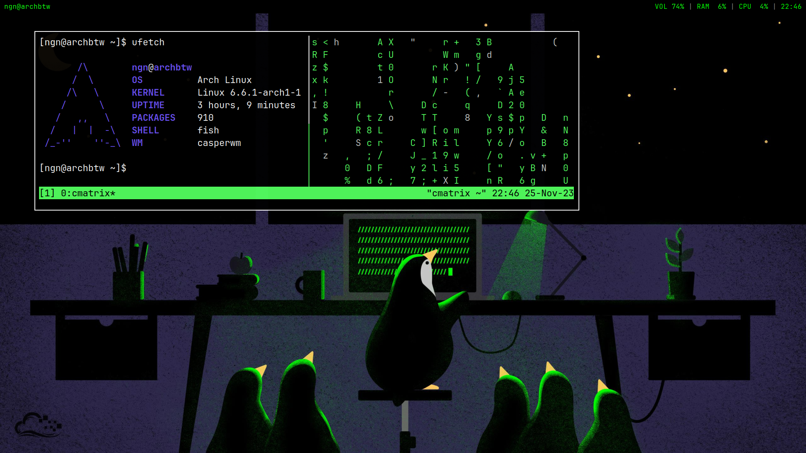

# casperwm | just a simple window manager
casperwm is just a simple X11 window manager that I wrote for fun

### features
- vertical split
- window borders
- simple float mode



- workspaces
- autostart
- simple config

### build & install
to compile casperwm, you will ned `libx11`, `libinih`, `gcc` and `make`, which you can 
install with your package manager 

then you can clone the repository and build it with `make`: 
```bash
git clone https://github.com/ngn13/casperwm.git
cd casperwm && make
sudo make install
```
after that you can run casperwm using your favorite display manager or with the `.xinitrc`
script

### start script
casperwm runs a startup script on start, this script can be found at `~/.config/casperwm/start`
you can edit this script or you can replace it with any executable script/binary

### config
configuration file uses the `.INI` format and it can be found at `~/.config/casperwm/config`
after the installation (it contains comments so you can understand most of the options by reading them)

config contains two main sections: 
- `[general]`: this section contains all general wm options
- `[bind...]`: any section that starts with `bind` contains key bindings, you can name the 
section whatever you want, as long as section name starts with `bind`, casperwm will 
load that section as key binding 

key bindings contain 4 different options:
- `key`: actual key to bind 
- `mod`: mod needed by this binding, dont add `mod` to your binding if you just want to use the master 
mod defined in `[general]` section 
- `action`: action that this binding triggers
- `argument`: argument for the action

all the actions are listed below:
- `launch`: launches the program specified with the `argument`
- `close`: closes the active window 
- `quit`: quits the window manager 
- `focus`: changes focus to the next window 
- `workspace`: changes workspace to the workspace specified with the `argument`
- `send`: sends window to the workspace specified with the `argument`
- `float`: takes active window to the float mode 
- `resize`: resizes active float window according to the `argument`, avaliable arguments are:
`shrink_left`, `shrink_down`, `shrink`, `grow_left`, `grow_down` and `grow` 
- `move`: moves the active float window according to the `argument`, avaliable arguments are:
`left`, `right`, `up` and `down` 


### issues/pull requests
if you are having problems with the wm, enable debug mode in the config and redirect output to a 
file, obtain the related output from this file and create an issue explaining your problem

if you want to contribute by sending a pull request, feel free to do so, im open to all ideas!
